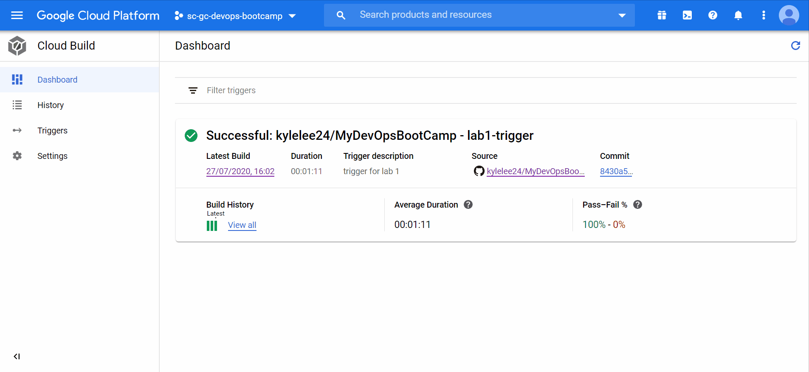
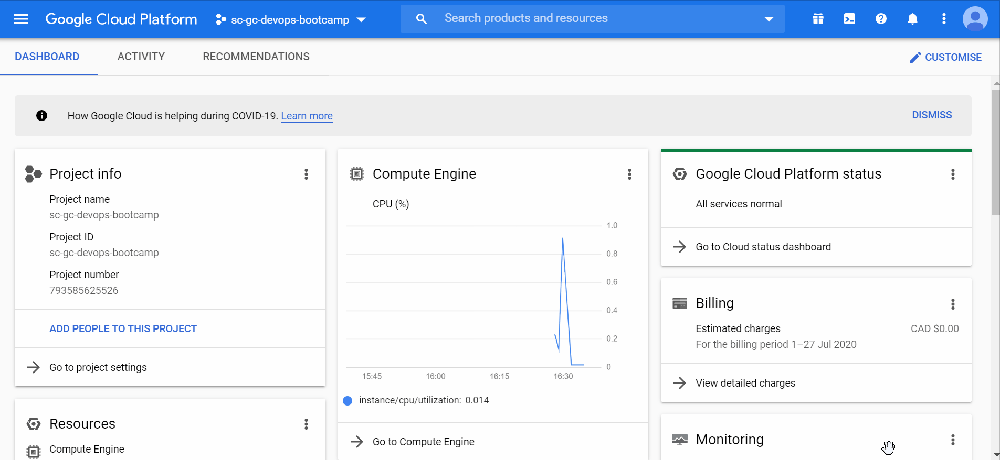
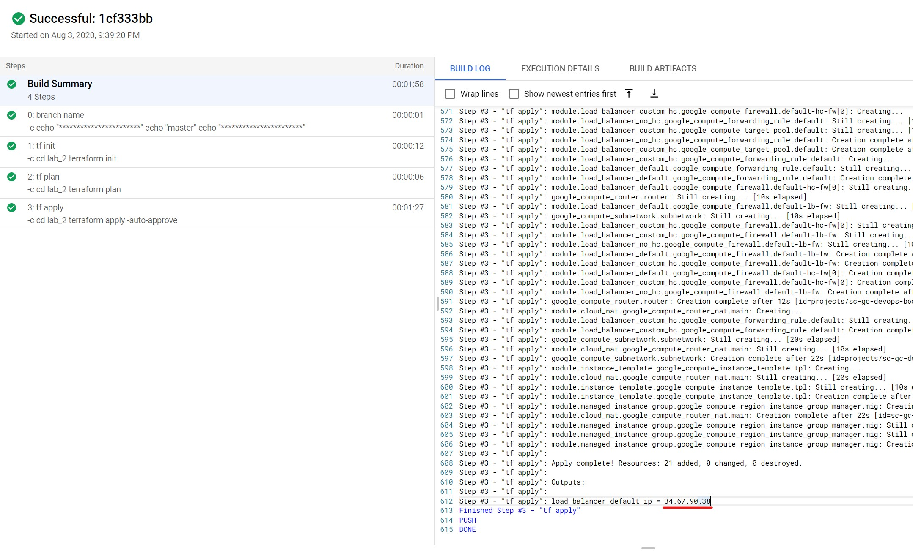
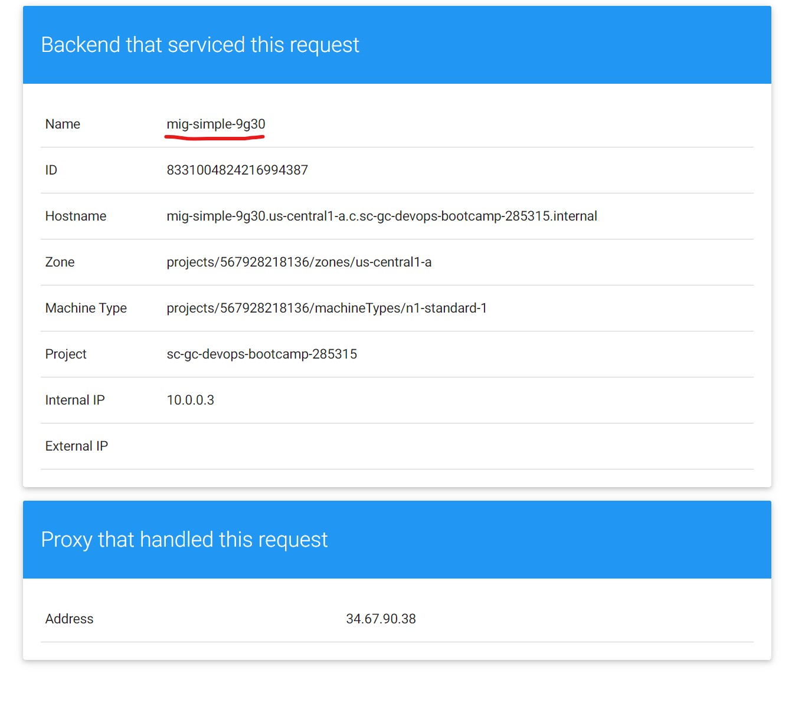
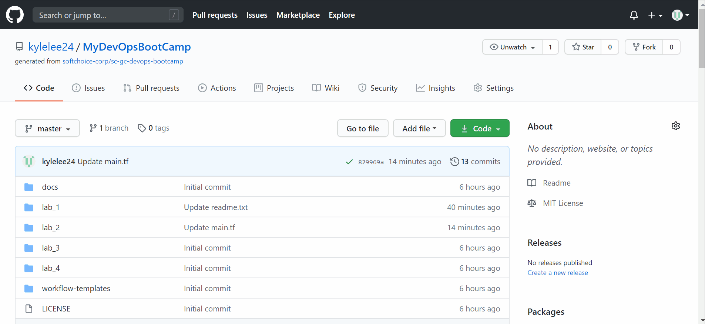
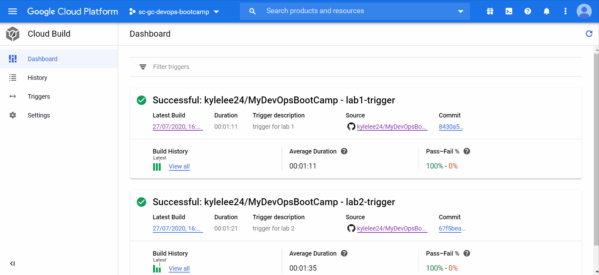
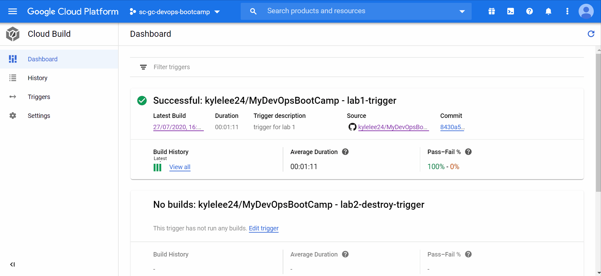
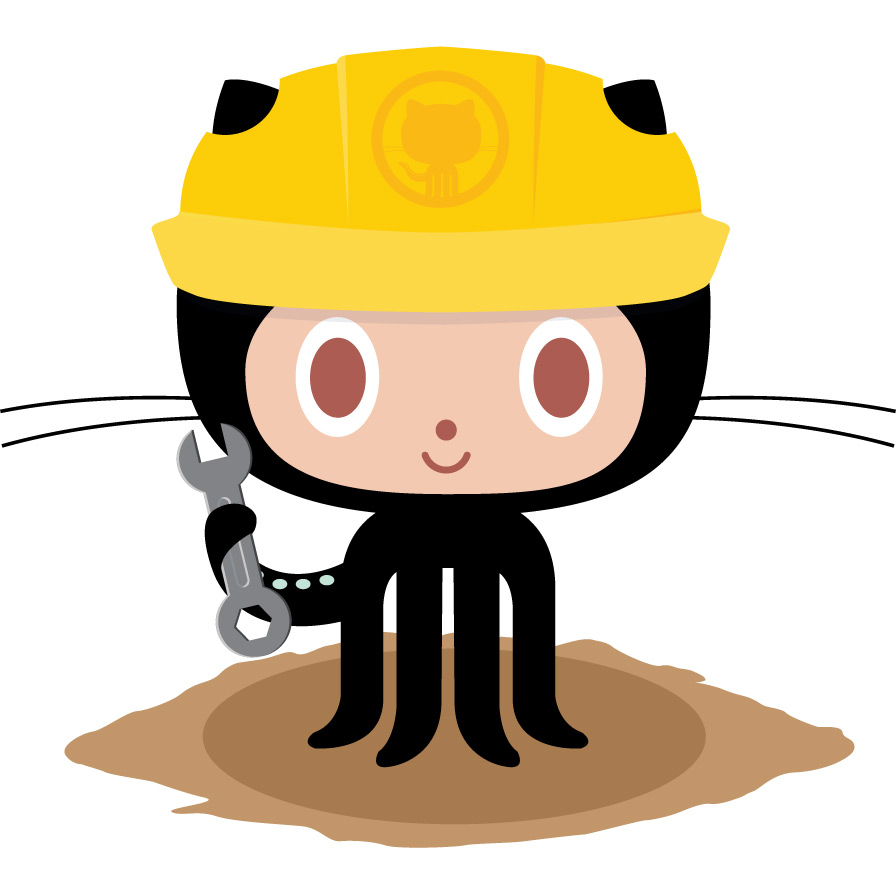

# Lab 2 - IaaS

- [Overview](#Overview)
- [Enable required Google Cloud APIs](#Enable-required-Google-Cloud-APIs)
- [Update Cloud Build service account permissions](#Update-Cloud-Build-service-account-permissions)
- [Create Cloud Storage bucket for Terraform state](#Create-Cloud-Storage-bucket-for-Terraform-state)
- [Configure GitHub App Triggers](#Configure-GitHub-App-Triggers)
- [Run Cloud Build](#Run-Cloud-Build)
- [Scale Out Resources](#Scale-Out-Resources)
- [Clean Up Resources](#Clean-Up-Resources)

---

## Overview

The second lab will deploy IaaS components consisting of a Virtual Private Cloud (VPC), Virtual Machines, Load Balancer using Terraform scripts via Cloud Build.

---

## Enable required Google Cloud APIs

1. Start Cloud Shell.

> 

2. In Cloud Shell, enable the Compute and IAM APIs with the following commands:

```bash
gcloud services enable compute.googleapis.com
gcloud services enable iam.googleapis.com
```

## Update Cloud Build service account permissions

To allow Cloud Build service account to run Terraform scripts with the goal of managing Google Cloud resources, you need to grant it appropriate access to your project. For simplicity, project editor access is granted here. But when the project editor role has a wide-range permission, in production environments you must follow your company's IT security best practices, usually providing least-privileged access.

1. Start Cloud Shell.

> 

2. In Cloud Shell, retrieve the email for your project's Cloud Build service account using the following commands:

```bash
PROJECT_ID=$(gcloud config get-value project)
CLOUDBUILD_SA="$(gcloud projects describe $PROJECT_ID \
    --format 'value(projectNumber)')@cloudbuild.gserviceaccount.com"
```

3. Grant the required access to your Cloud Build service account using the following command:

```bash
gcloud projects add-iam-policy-binding $PROJECT_ID \
    --member serviceAccount:$CLOUDBUILD_SA --role roles/editor
```

---

## Create Cloud Storage bucket for Terraform state

By default, Terraform stores state locally in a file named `terraform.tfstate`. This default configuration can make Terraform usage difficult for teams, especially when many users run Terraform at the same time and each machine has its own understanding of the current infrastructure. To help you avoid such issues, this section configures a remote state that points to a Cloud Storage bucket. Remote state is a feature of backends and, in this bootcamp, is configured in the `backend.tf` files.

1. Start Cloud Shell.

> 

2. In Cloud Shell, create the Cloud Storage bucket using the following commands:

```bash
PROJECT_ID=$(gcloud config get-value project)
gsutil mb gs://${PROJECT_ID}-tfstate
```

3. Enable Object Versioning to keep the history of your deployments using the following command:

```bash
gsutil versioning set on gs://${PROJECT_ID}-tfstate
```

5. In GitHub, edit the `lab_2/backend.tf` file and update the `bucket` value of the `PROJECT_ID` placeholder with the `${PROJECT_ID}` value (E.g., `sc-gc-devops-bootcamp-284719-tfstate`).

Example:

```json
terraform {
  backend "gcs" {
    bucket = "sc-gc-devops-bootcamp-284719-tfstate"
    prefix = "terraform/bootstrap/state"
  }
}
```

6. Commit the changes.

---

## Configure GitHub App Triggers

We will now configure a Cloud Build trigger that will run the terraform commands to deploy the networking and compute resources in this project.

1. Open the **Triggers** page in the [Google Cloud Console](https://console.cloud.google.com/) and click **Create Trigger**

2. Similar to Lab 1, enter a name (E.g., `lab2-trigger`) and description (E.g., `trigger for lab 2`) for your trigger.

3. Under Event, select Push to a new branch.

4. Under Source, select the repository that was connected earlier (E.g., githubuser/MyDevOpsBootCamp (GitHub App)). Enter `.*` for branch to trigger build on all branches.

5. Expand the 'Show Included and Ignored File Filters' section and enter `lab_2/**` under 'Included files filter (glob)' to indicate that only changes under the `lab_2/` folder should trigger a build. Enter `lab_2/destroy.txt` under 'Ignored files filter (glob)' to indicate that the file should not trigger a build.

6. Enter `lab_2/cloudbuild-lab2.yaml` under 'Cloud Build configuration file (YAML or JSON)'. This configuration file defines the build steps that will be performed when a build is triggered.

7. Click Create to finish creating the trigger on Cloud Build.

> 


---

## Run Cloud Build

The workflow we just created is triggered by changes made to the files in the `lab_2/` directory. Let's make a change here to kick off the workflow. The `readme.txt` can be modified by simply adding a new line or some text. The act of committing this change to the `master` branch will instruct GitHub Actions to kick off our workflow.

1. Navigate to **Code**, and browse to the `lab_2/readme.txt` file. Click the pencil icon to edit the file, and add a new line. Provide a commit message and commit your change.

2. Navigate to **Cloud Build -> History** and you should see the build executing with the lab2-trigger name.

The workflow for Lab 2 is going to take a few minutes to execute. While it is running take a look at the terraform files (E.g., `lab_2/main.tf`, `lab2/network.tf`) and try to infer what resources will be deployed.

The terraform files defines several Google Cloud resources to deploy:

- Virtual Network with one subnet.
- Managed instance group with two instances in the same region.
- Network TCP load balancer.

> 

3. Once the workflow has completed you can access the [Google Cloud Console](https://console.cloud.google.com/) and view the resources the workflow created. In the [Google Cloud Console](https://console.cloud.google.com/) click the top left &#9776; hamburger menu, navigate to Compute Engine to view the running instances. Navigate to VPC Network -> VPC Networks to see the VPCs created. Navigating to Network Services -> Load Balancing will display the load balancers created.

> 

4. Retrieve / copy the IP address to the load balancer from the Cloud Build output and paste on a new tab on your browser to view the basic webpage served from the vm instance(s) you just created.

> 

5. Since the load balancer serves the webpage content from either vm instance in round robin fashion, refreshing the webpage a few times on your browser, you will notice the name of the vm instance backend that serviced the request change.

>

---

## Scale Out Resources

Let's scale out the solution from 2 virtual machines to 4.

1. In GitHub, navigate to **Code** and browse to the `lab_2/main.tf` file.

2. Click the pencil icon to edit the file. In the `managed_instance_group` module, change the `target_size` from 2 to 4.

3. Enter a commit message and click `Commit changes`.

> 

4. Navigate to **Cloud Build -> History** and you should see your build executing.

5. Once the build is completed we can open the [Google Cloud Console](https://console.cloud.google.com/) and confirm there are now four virtual machines deployed. We can also check the Load Balancer and see that all 4 are already configured in the backend server pool.

---

## Clean Up Resources

To mimimize billing usage in your subscription we can remove all of the resources we deployed with Cloud Build by executing a Terraform destroy.

1. Create a new trigger on Cloud Build called `lab2-destroy-trigger`.

2. Use similar settings to the trigger created previously, except set the Included files filter to `lab_2/destroy.txt`, leave the Ignored files filter blank. For the Build Configuration, set the Cloud Build configuration file to `lab_2/cloudbuild-destroy-lab2.yaml`. Click create to finish creating the trigger.

> 

3. Go to the triggers page and select Run trigger to manually execute the build, which will destroy all the resources created.

> 

4. Once the build is completed we can open the [Google Cloud Console](https://console.cloud.google.com/) and confirm the resources we created earlier are now deleted.

---

## End of Lab 2

Links to more learning:

- **Managing Infrastructure as code**: [https://cloud.google.com/solutions/managing-infrastructure-as-code](https://cloud.google.com/solutions/managing-infrastructure-as-code)
- **Substituting Cloud Build variable values**: [https://cloud.google.com/cloud-build/docs/configuring-builds/substitute-variable-values](https://cloud.google.com/cloud-build/docs/configuring-builds/substitute-variable-values)
- **Terraform on Google Cloud**: [https://cloud.google.com/community/tutorials/getting-started-on-gcp-with-terraform](https://cloud.google.com/community/tutorials/getting-started-on-gcp-with-terraform)
- **Google Cloud VPC**: [https://cloud.google.com/solutions/best-practices-vpc-design](https://cloud.google.com/solutions/best-practices-vpc-design)
- **Google Cloud Virtual Machines**: [https://cloud.google.com/compute/docs/instances](https://cloud.google.com/compute/docs/instances)
- **Google Cloud Load Balancer**: [https://cloud.google.com/load-balancing/docs/network](https://cloud.google.com/load-balancing/docs/network)
- **Managed Instance Groups**: [https://cloud.google.com/compute/docs/instance-groups/working-with-managed-instances](https://cloud.google.com/compute/docs/instance-groups/working-with-managed-instances)

